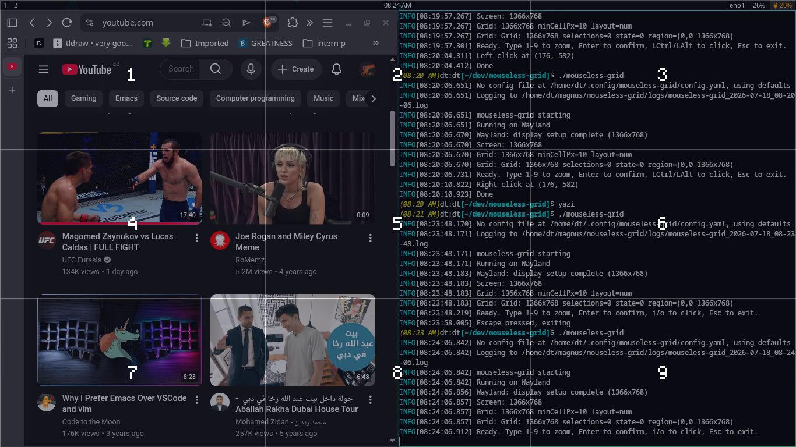
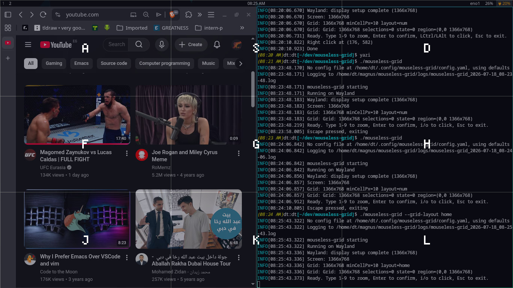

* mouseless-grid

  On-screen grid clicker for Linux. Type 1-9 to zoom into a 3×3 grid,
  then press /i/ to left-click or /o/ to right-click at the target.

  Pure Go, single binary, no cgo. X11 and Wayland.

** Features

  - ImageJ-style zoom: number keys recursively divide screen into 3×3 cells
  - Arrangement: 1-9 on numpad, or asdfghjkl on home row (=--grid-layout=)
  - Auto-stops when cell width ≤ minCellPx (default 10px)
  - /i/ left-click, /o/ right-click at the current cell center (works from any zoom level)
  - Enter confirms early without max zoom
  - Backspace to undo one zoom level
  - Escape to cancel
  - Click-through overlay — click actions pass through to the target window
  - Works on X11 and Wayland (Hyprland, Sway, wlroots-based compositors)
  - X11: ARGB overlay + XTest WarpPointer + uinput click
  - Wayland: wlr-layer-shell overlay + wlr-virtual-pointer + wl_keyboard input
  - Built-in bitmap font (4×6, A-Z, a-z, 0-9)
  - Per-keypress logging (info) for easy debugging
  - Runtime platform detection (XDG_SESSION_TYPE / WAYLAND_DISPLAY)

** Tech Stack

  | Layer        | Library                          | Purpose                                |
  |--------------+----------------------------------+----------------------------------------|
  | Keyboard(X11)| golang-evdev                     | evdev grab from /dev/input/event*       |
  | Keyboard(Way)| neurlang/wayland (wl_keyboard)   | Compositor-routed keyboard input        |
  | Mouse (X11)  | bendahl/uinput + XTest           | Virtual click + cursor warp             |
  | Mouse (Way)  | wlr-virtual-pointer + uinput     | Virtual pointer via Wayland protocol    |
  | Overlay (X11)| jezek/xgb                        | X11 transparent window (ARGB visual)    |
  | Overlay (Way)| neurlang/wayland + wlr-layer-shell| Wayland layer-surface overlay           |
  | Config       | yaml.v2 + go-flags               | YAML config + CLI arguments              |
  | Logging      | logrus                           | Structured file logging                  |

** Project Structure

  #+begin_example
  mouseless-grid/
  ├── main.go              # entry point, event loop, state machine
  ├── config/
  │   ├── config.go        # YAML config loading, defaults (GridLayout field)
  │   └── keydefs.go       # evdev keycode <-> string mapping
  ├── keyboard/
  │   └── keyboard.go      # evdev device read loop (X11 only on Wayland)
  ├── mouse/
  │   ├── mouse.go         # Pointer interface
  │   ├── mouse_x11.go     # XTest WarpPointer + uinput virtual mouse
  │   └── mouse_wayland.go # wlr-virtual-pointer
  ├── overlay/
  │   ├── overlay.go       # Window interface + SaveDebugImage helper
  │   ├── overlay_x11.go   # X11 ARGB window, transparency, click-through
  │   └── overlay_wayland.go # wlr-layer-shell overlay + wl_keyboard input
  ├── grid/
  │   ├── grid.go          # Grid math, zoom state machine, rendering
  │   └── font.go          # Tiny 4x6 bitmap font (A-Z, a-z, 0-9)
  ├── wlr/                 # Generated wlr-layer-shell + wlr-virtual-pointer bindings
  ├── plan-todos.org       # implementation steps
  ├── bugs.org             # known bugs
  ├── README.org           # this file
  └── changelog.org        # version history
  #+end_example

  Logs: ~/magnus/mouseless-grid/logs/

** Dependencies (system)

  These must be present on the system for the app to work:

  | Dependency          | Why                              | How to set up                                                     |
  |---------------------+----------------------------------+-------------------------------------------------------------------|
  | X11 (Xorg)          | X11 overlay (X11 mode)           | Already running if you're on X11                                   |
  | Wayland compositor  | Wayland overlay (Wayland mode)   | Hyprland, Sway, or any wlroots-based compositor                    |
  | evdev kernel module | Read keyboard events (X11)       | Already loaded on any modern Linux                                 |
  | uinput kernel module| Virtual mouse device             | =sudo modprobe uinput= (add to /etc/modules-load.d/ to persist)    |
  | wlr-layer-shell     | Wayland overlay surface          | Supported by Hyprland, Sway, and most wlroots compositors          |
  | wlr-virtual-pointer | Wayland cursor movement + clicks | Supported by Hyprland, Sway, and most wlroots compositors          |
  | Go 1.26+            | Building from source             | Install: =sudo apt install golang= or =sudo pacman -S go=         |

** Quick Start

  #+begin_src bash
  # Clone
  git clone git@github.com:megamind1230/mouseless-grid.git
  cd mouseless-grid

  # Build
  go build -o mouseless-grid .

  # Run
  sudo ./mouseless-grid
  #+end_src

** How to Run

  #+begin_src bash
  # Build from source
  go build -o mouseless-grid .

  # Run with defaults
  sudo ./mouseless-grid

  # Run with custom config
  sudo ./mouseless-grid --config /path/to/config.yaml

  # Home-row grid layout (asdfghjkl)
  sudo ./mouseless-grid --grid-layout home

  # List available keyboard devices
  sudo ./mouseless-grid --list-devices

  # Verbose debug output
  sudo ./mouseless-grid --debug

  # Generate default config file
  sudo ./mouseless-grid --gen-config

  # Save rendered overlay to PNG for inspection
  sudo ./mouseless-grid --save-debug

  # Diagnostic mode: create overlay, print window ID, sleep 10s
  sudo ./mouseless-grid --check

  # Build + run in one step (no binary left behind)
  sudo go run . --debug
  #+end_src

** Usage

  1. Run the app — full-screen transparent overlay appears with 3×3 grid
  2. Press a number key to zoom into that cell — the region subdivides into another 3×3
     - Numpad: 1-9 (default) or Home-row: A S D F G H J K L (--grid-layout home)
  3. Repeat to refine position — zoom auto-stops when cell is small enough
  4. Press /i/ to left-click or /o/ to right-click at the current cell center
     - Clicks work immediately after any zoom — no need to press Enter first
  5. Press Enter to "hold position" (prevents further zooming)
  6. Press Backspace to undo last zoom step
  7. Press Escape to cancel and exit

** Grid Layouts

   Numpad layout (=--grid-layout num=, default):
   #+begin_example
   1  2  3
   4  5  6
   7  8  9
   #+end_example

   

   Home-row layout (=--grid-layout home=):
   #+begin_example
   A  S  D
   F  G  H
   J  K  L
   #+end_example

   

  Click coordinate = center of the final cell.

** CLI Flags

  | Flag              | Description                                      |
  |-------------------+--------------------------------------------------|
  | -v / --version    | Show version                                     |
  | -d / --debug      | Verbose debug output (stdout + log file)         |
  | -c / --config     | Path to config file (default: ~/.config/...)     |
  | -l / --list-devices | List keyboard devices                           |
  | --gen-config      | Generate default config file and exit            |
  | --save-debug      | Save rendered overlay as PNG to log dir          |
  | --check           | Create overlay, log window ID, sleep 10s         |
  | --grid-layout     | Grid layout: num (default) or home               |

** Config

  Default location: ~/.config/mouseless-grid/config.yaml

  #+begin_src yaml
  minCellPx: 10        # stop zooming when cell width ≤ this
  bgColor: "#1a1a2e"   # background color (hex)
  textColor: "#e0e0e0" # label color
  highlightColor: "#00d4ff" # selected cell color
  opacity: 0.4         # window opacity
  logPath: "~/magnus/mouseless-grid/logs/"
  gridLayout: "num"    # num (1-9) or home (asdfghjkl)
  #+end_src

** Permissions

  The app needs:
  - Read access to /dev/input/event* (keyboard devices)
  - Write access to /dev/uinput (virtual device creation)

  Setup without root:
  #+begin_src bash
  sudo groupadd --system uinput
  sudo usermod -a -G input,uinput $USER
  sudo tee /etc/udev/rules.d/99-mouseless-grid.rules <<EOF
  KERNEL=="uinput", GROUP="uinput", MODE="0660"
  EOF
  # Reboot or: sudo modprobe uinput
  #+end_src

** inspirations
https://mouseless.click/
https://github.com/jbensmann/mouseless
